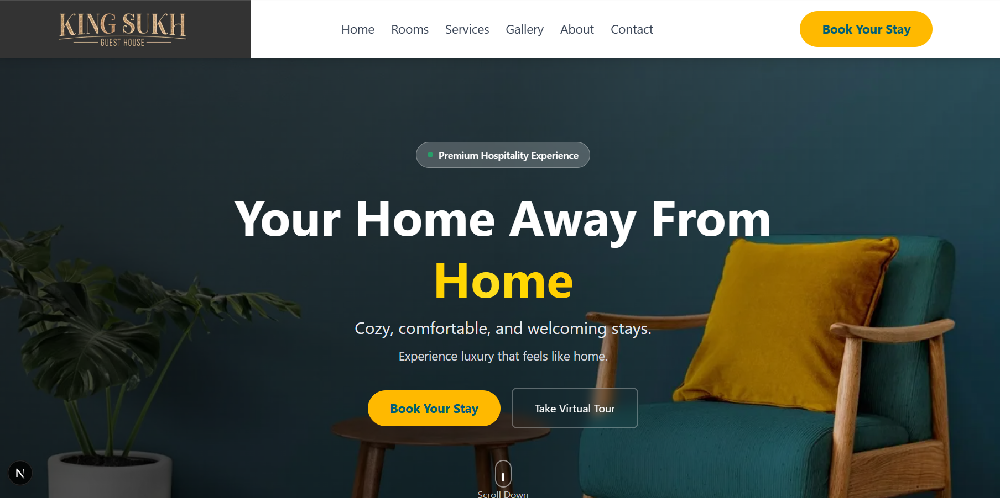
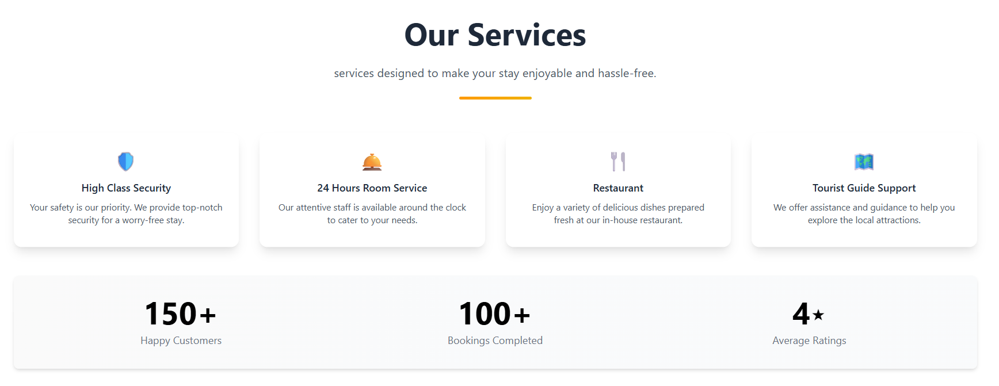
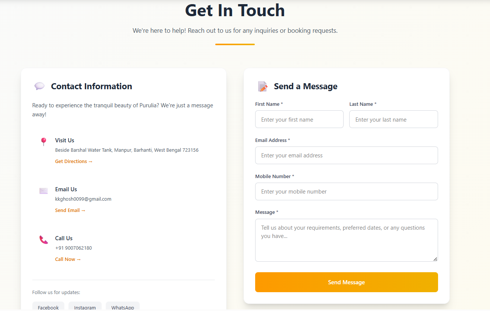

#  Kingsukh Guest House

<div align="center">



**Your Gateway to Tranquil Beauty in Purulia**

[](https://intern-project-ksgh.vercel.app/)
[](https://github.com/hariomphogat/intern-project-KSGH.git)
[](https://nextjs.org/)
[](https://tailwindcss.com/)

</div>

---

##  **Internship Project Overview**

Kingsukh Guest House is a modern, responsive website showcasing a serene hospitality experience in the heart of Purulia, West Bengal. This project demonstrates advanced web development techniques with smooth animations, modern UI/UX design, and optimal performance.

###  **Key Highlights**

- **Location**: Beside Barshal Water Tank, Manpur, Barhanti, West Bengal - 723156
- **Surrounded by**: Biharinath Hill, Baranti Hill, Susunia Hill, Joychandi Hill, Garhpanchkot, Baranti Dam, Maithon Dam, and Panchat Dam
- **Experience**: Tranquil retreat with modern amenities and heartfelt hospitality

---

##  **Live Demo & Repository**

<div align="center">

### **[Visit Live Website](https://intern-project-ksgh.vercel.app/)**

</div>

---

##  **Features**

###  **Design & User Experience**
-  Modern UI/UX with gradient backgrounds and card-based layouts
-  Smooth Animations powered by Framer Motion
-  Parallax Scrolling effects for immersive experience
-  Responsive Design optimized for all devices
-  Interactive Elements with hover effects and micro-interactions
-  Loading States and skeleton screens for better UX

###  **Core Functionality**
-  Hero Section with animated content and virtual tour button
-  Room Showcase with detailed cards and booking options
-  Services Display highlighting guest house amenities
-  About Section featuring location and nearby attractions
-  Contact Form with validation and Google Maps integration
-  Animated Counters showing guest satisfaction metrics

###  **Performance & SEO**
-  Next.js 13+ with App Router for optimal performance
-  Image Optimization with WebP format and lazy loading
-  SEO Optimized with proper meta tags and structured data
-  PWA Ready with manifest and service worker support
-  ast Loading with code splitting and caching strategies

---

## **Tech Stack**

<div align="center">

| Frontend | Styling | Animation | Backend | Deployment |
|----------|---------|-----------|---------|------------|
|  |  |  |  |  |

</div>

### **Detailed Tech Stack**

```json
{
  "frontend": {
    "framework": "Next.js 13+ (App Router)",
    "language": "JavaScript/JSX",
    "styling": "Tailwind CSS",
    "animations": "Framer Motion",
    "icons": "Lucide React Icons"
  },
  "forms": {
    "validation": "React Hook Form + Yup",
    "components": "Custom form components"
  },
  "performance": {
    "images": "Next.js Image Optimization",
    "fonts": "Next.js Font Optimization",
    "caching": "Static Generation + ISR"
  },
  "deployment": {
    "platform": "Vercel",
    "domain": "Custom domain support",
    "analytics": "Vercel Analytics ready"
  }
}
```

---

## **Project Structure**

```
intern-project-KSGH/
├──  README.md
├──  package.json
├──  next.config.js
├──  tailwind.config.js
├──  public/
│   ├──  images/
│   ├──  favicon.ico
│   └──  site.webmanifest
├──  src/
│   ├──  app/
│   │   ├──  layout.js
│   │   ├──  page.js
│   │   └──  globals.css
│   ├──  components/
│   │   ├──  sections/
│   │   │   ├──  HeroSection.jsx
│   │   │   ├──  RoomsSection.jsx
│   │   │   ├──  ServicesSection.jsx
│   │   │   ├──  AboutSection.jsx
│   │   │   └──  ContactSection.jsx
│   │   └──  ui/
│   └──  utils/
│       ├──  ButtonCTA.jsx
│       ├──  RoomCard.jsx
│       ├──  ServiceCard.jsx
│       ├──  Counter.jsx
│       └──  SectionHeading.jsx
├──  constants/
│   └──  index.js
└──  styles/
    └──  globals.css
```


### **Hero Section**

*Immersive hero section with parallax background, animated text, and smooth scroll indicators*

**Features:**
- Parallax scrolling background
- Staggered text animations
- Interactive CTA buttons
- Smooth scroll to sections
- Mobile-optimized layout

### **Rooms Showcase**

*Elegant room cards with hover effects and detailed information*

**Features:**
- Interactive room cards
- Image lazy loading
- Price displays
- Booking CTAs
- Responsive grid layout

###  **Services Display**

*Comprehensive services with animated icons and descriptions*

**Features:**
- Animated service cards
- Icon animations
- Feature highlights
- Statistics counters
- Progressive disclosure

### **Contact & Location**

*Professional contact form with Google Maps integration*

**Features:**
- Form validation
- Google Maps embed
- Contact information cards
- Loading states
- Success/error messaging

---


## 📋 **Work Done**

- [x] Responsive design implementation
- [x] Core animations with Framer Motion
- [x] Contact form with validation
- [x] Google Maps integration
- [x] Performance optimization


## 📞 **Contact Information**

<div align="center">

### 3E8 **Kingsukh Guest House**

📍 **Address**: Beside Barshal Water Tank, Manpur, Barhanti, West Bengal - 723156

📞 **Phone**: [+91 9007062180](tel:+919007062180)

📧 **Email**: [kkghosh0099@gmail.com](mailto:kkghosh0099@gmail.com)

🌐 **Website**: [https://intern-project-ksgh.vercel.app/](https://intern-project-ksgh.vercel.app/)

---

### 👩‍💻 **Developer**

**Hariom**  
*Full Stack Developer & Data Science Enthusiast*

🎓 **Education**: MSc in Data Science and Machine Learning  
🏆 **Specialization**: Full Stack WebApp Development  

**Technical Expertise:**
- **Frontend**: React.js, Next.js, React Native, Tailwind CSS, javascript/typescript
- **Backend**: Node.js, Express.js, RESTful APIs
- **Mobile**: React Native, Expo, Native Development
- **Data Science**: Python, Machine Learning Algorithms, Statistical Analysis
- **Tools**: Git, Figma, Adobe XD, Canva, 
- **Databases**: MongoDB, PostgreSQL, Firebase


[](https://hariomphogat.vercel.app)
[](https://linkedin.com/in/hariomphogat)
[](https://github.com/hariomphogat)

*"Bridging the gap between technology and user experience..."*

</div>

---

## 📄 **License**

This project is licensed under the MIT License - see the [LICENSE](LICENSE) file for details.

```
MIT License

Copyright (c) 2025 Hariom

Permission is hereby granted, free of charge, to any person obtaining a copy
of this software and associated documentation files (the "Software"), to deal
in the Software without restriction, including without limitation the rights
to use, copy, modify, merge, publish, distribute, sublicense, and/or sell
copies of the Software, and to permit persons to whom the Software is
furnished to do so, subject to the following conditions:

The above copyright notice and this permission notice shall be included in all
copies or substantial portions of the Software.
```

---

## 🙏 **Acknowledgments**


- **Design Inspiration**: Modern hospitality websites and booking platforms
- **Technical Resources**: Next.js documentation, Framer Motion guides, Tailwind CSS
- **Icons**: Lucide React icon library
- **Fonts**: Inter font family for modern typography
- **Special Thanks**: To the **Innobyte Services** for this internship Opportunity

---

<div align="center">

### **Thank you for visiting Kingsukh Guest House!**

**Made with ❤️ by Hariom**

[](https://intern-project-ksgh.vercel.app/)
[](https://github.com/hariomphogat/intern-project-KSGH)

</div>

